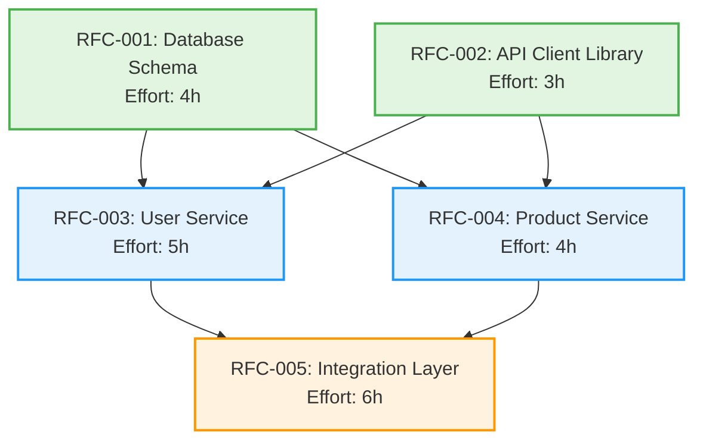

# Sprint N - RFC Dependency Graph

> **Purpose**: Visual representation of RFC dependencies and wave assignments.
> **Usage**: Use this to understand which RFCs can be parallelized and execution order.
> **Updates**: Updated by architects when RFCs are approved or dependencies change.

**Last Updated**: YYYY-MM-DD
**Sprint**: Sprint N
**Total RFCs**: X
**Total Waves**: Y

---

## Dependency Graph (Mermaid)



---

## Wave Breakdown

### Wave 1: Foundation (No Dependencies)
**Parallel Execution**: All RFCs can start simultaneously
**Total Effort**: 4h (max of all RFCs in wave)

| RFC | Title | Effort | Blocks | File |
|-----|-------|--------|--------|------|
| RFC-001 | Database Schema | 4h | RFC-003, RFC-004 | [001-database-schema.md](../rfcs/approved/001-database-schema.md) |
| RFC-002 | API Client Library | 3h | RFC-003, RFC-004 | [002-api-client.md](../rfcs/approved/002-api-client.md) |

**Why Wave 1?** These RFCs have no dependencies and provide foundation for later work.

---

### Wave 2: Core Services (Depends on Wave 1)
**Prerequisites**: Wave 1 must complete
**Parallel Execution**: All Wave 2 RFCs can run simultaneously once Wave 1 is done
**Total Effort**: 5h (max of all RFCs in wave)

| RFC | Title | Effort | Blocked By | Blocks | File |
|-----|-------|--------|------------|--------|------|
| RFC-003 | User Service | 5h | RFC-001, RFC-002 | RFC-005 | [003-user-service.md](../rfcs/approved/003-user-service.md) |
| RFC-004 | Product Service | 4h | RFC-001, RFC-002 | RFC-005 | [004-product-service.md](../rfcs/approved/004-product-service.md) |

**Why Wave 2?** Both services need the database schema (RFC-001) and API client (RFC-002). They are independent of each other.

---

### Wave 3: Integration (Depends on Wave 2)
**Prerequisites**: Wave 2 must complete
**Parallel Execution**: Single RFC, but would parallelize with other Wave 3 RFCs if present
**Total Effort**: 6h

| RFC | Title | Effort | Blocked By | File |
|-----|-------|--------|------------|------|
| RFC-005 | Integration Layer | 6h | RFC-003, RFC-004 | [005-integration.md](../rfcs/approved/005-integration.md) |

**Why Wave 3?** Requires both user service (RFC-003) and product service (RFC-004) to be complete.

---

## Dependency Matrix

Quick reference for "What blocks what?"

|         | RFC-001 | RFC-002 | RFC-003 | RFC-004 | RFC-005 |
|---------|---------|---------|---------|---------|---------|
| **RFC-001** | -       | ⚪      | ✅      | ✅      | ⚪      |
| **RFC-002** | ⚪      | -       | ✅      | ✅      | ⚪      |
| **RFC-003** | ❌      | ❌      | -       | ⚪      | ✅      |
| **RFC-004** | ❌      | ❌      | ⚪      | -       | ✅      |
| **RFC-005** | ❌      | ❌      | ❌      | ❌      | -       |

**Legend**:
- ✅ = Row blocks column (e.g., RFC-001 blocks RFC-003)
- ❌ = Row is blocked by column (e.g., RFC-003 is blocked by RFC-001)
- ⚪ = No dependency relationship

---

## Critical Path Analysis

**Critical Path**: RFC-001 → RFC-003 → RFC-005
**Path Duration**: 4h + 5h + 6h = 15h (longest sequential path)

**Alternative Paths**:
- RFC-001 → RFC-004 → RFC-005: 4h + 4h + 6h = 14h
- RFC-002 → RFC-003 → RFC-005: 3h + 5h + 6h = 14h
- RFC-002 → RFC-004 → RFC-005: 3h + 4h + 6h = 13h

**With Parallelization**:
- Wave 1: max(4h, 3h) = 4h
- Wave 2: max(5h, 4h) = 5h
- Wave 3: 6h
- **Total: 15h** (vs 22h sequential)

**Time Savings**: 7 hours (32% faster)

---

## Execution Plan

### Sequential Execution (DON'T DO THIS)
```
RFC-001 (4h) → RFC-002 (3h) → RFC-003 (5h) → RFC-004 (4h) → RFC-005 (6h)
Total: 22 hours
```

### Optimized Parallel Execution (DO THIS)
```
Wave 1 (4h):  RFC-001 + RFC-002 in parallel
              ↓
Wave 2 (5h):  RFC-003 + RFC-004 in parallel
              ↓
Wave 3 (6h):  RFC-005

Total: 15 hours (32% faster)
```

---

## Dependency Changes

### Change Log

**YYYY-MM-DD**: Initial dependency graph created
- 5 RFCs organized into 3 waves
- Critical path identified: RFC-001 → RFC-003 → RFC-005

**YYYY-MM-DD**: RFC-006 added
- Added to Wave 2 (depends on RFC-001 only)
- No impact on critical path

**YYYY-MM-DD**: RFC-003 dependency removed
- RFC-003 no longer depends on RFC-002
- RFC-003 moved to Wave 1
- Critical path reduced to 13h

---

## Validation Rules

### Wave Assignment Rules

1. **Wave 1**: `Blocked By = []` (no dependencies)
2. **Wave N**: `Blocked By ⊆ (Wave 1 ∪ Wave 2 ∪ ... ∪ Wave N-1)` (only depends on earlier waves)

### Dependency Validation

Before starting Wave N:
- [ ] All RFCs in Wave 1 to Wave N-1 are completed
- [ ] All blocking RFCs are marked as implemented
- [ ] No circular dependencies exist

### Circular Dependency Check

**Status**: ✅ No circular dependencies detected

If circular dependencies exist, they must be broken by:
1. Splitting RFC into smaller independent RFCs
2. Removing unnecessary dependency
3. Restructuring implementation order

---

## Quick Reference Commands

```bash
# View this dependency graph
cat .arch/sprints/sprint-N/DEPENDENCY-GRAPH.md

# Start Wave 1 (all RFCs in parallel)
/start-sprint-wave N 1

# Check wave status
cat .arch/sprints/sprint-N/WAVE-STATUS.md

# View specific RFC
cat .arch/rfcs/approved/001-database-schema.md
```

---

## Notes

### Tips for Reading This Graph

1. **Follow arrows**: Arrow from A → B means "A blocks B" (B must wait for A)
2. **Same wave = parallel**: All RFCs in same wave can execute simultaneously
3. **Colors**: Each wave has a different color for easy identification
4. **Critical path**: Longest path determines minimum sprint duration

### Updating This Graph

When RFC dependencies change:
1. Update the mermaid graph
2. Recalculate wave assignments
3. Update wave breakdown tables
4. Recalculate critical path and time savings
5. Update change log
6. Validate no circular dependencies

### Common Patterns

**Fan-out**: One RFC blocks many (e.g., RFC-001 → RFC-003, RFC-004)
- Creates natural parallelization opportunities
- Common with foundation RFCs (schema, libraries)

**Fan-in**: Many RFCs block one (e.g., RFC-003, RFC-004 → RFC-005)
- Integration points
- Wait for all prerequisites before starting

**Chain**: Linear dependencies (e.g., A → B → C → D)
- Cannot parallelize
- Should be avoided if possible

---

**Remember**: This graph should match the "Parallelization Plan" section in [sprint-N.md](../sprint-N.md). Any discrepancies should be resolved immediately.
