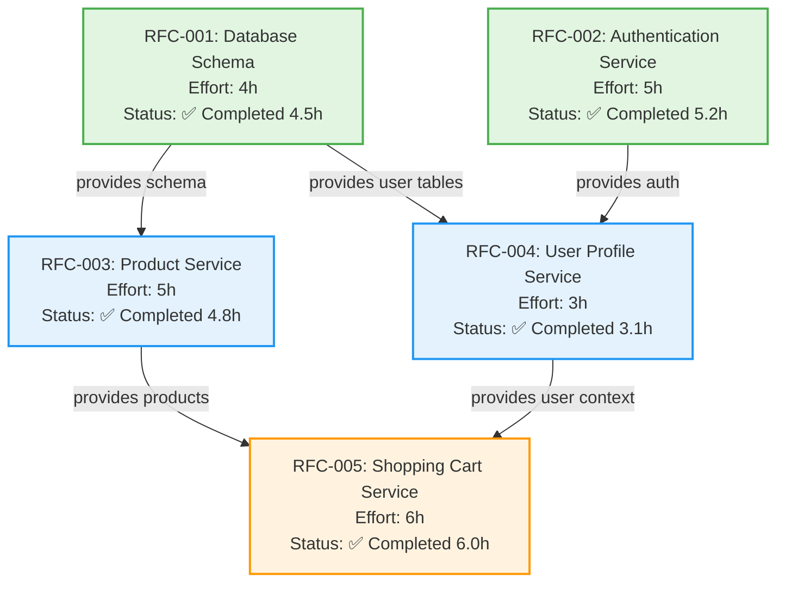

# Example Sprint - RFC Dependency Graph

> **Purpose**: Visual representation of RFC dependencies for E-Commerce MVP Sprint
> **Usage**: Understand parallelization opportunities and execution order
> **Last Updated**: 2025-11-17 (sprint completed)

**Sprint**: Example Sprint - E-Commerce MVP
**Total RFCs**: 5
**Total Waves**: 3
**Time Savings**: 36% (8.6h saved through parallelization)

---

## Dependency Graph (Mermaid)



---

## Wave Breakdown

### Wave 1: Foundation (No Dependencies - Completed)
**Parallel Execution**: Both RFCs ran simultaneously
**Wave Duration**: 5.2h (max of 4.5h and 5.2h)
**Status**: ✅ Completed

| RFC | Title | Effort Est. | Actual | Blocks | File |
|-----|-------|-------------|--------|--------|------|
| RFC-001 | Database Schema | 4h | 4.5h (+12.5%) | RFC-003, RFC-004 | [001-database-schema.md](../../rfcs/implemented/001-database-schema.md) |
| RFC-002 | Authentication Service | 5h | 5.2h (+4%) | RFC-004 | [002-auth-service.md](../../rfcs/implemented/002-auth-service.md) |

**Why Wave 1?**
- RFC-001: No dependencies - defines database structure
- RFC-002: No dependencies - standalone authentication service

**Actual Execution**:
- Both started: 2025-11-15 09:00
- RFC-001 completed: 2025-11-15 13:30 (4.5h)
- RFC-002 completed: 2025-11-15 14:12 (5.2h)
- Wave completed: 2025-11-15 14:12

**Variance**: +0.7h total (+9% over estimate)
- RFC-001: Added additional indexes not in spec
- RFC-002: JWT implementation took longer than expected

---

### Wave 2: Core Services (Depends on Wave 1 - Completed)
**Prerequisites**: Wave 1 completed ✅
**Parallel Execution**: Both RFCs ran simultaneously
**Wave Duration**: 4.8h (max of 4.8h and 3.1h)
**Status**: ✅ Completed

| RFC | Title | Effort Est. | Actual | Blocked By | Blocks | File |
|-----|-------|-------------|--------|------------|--------|------|
| RFC-003 | Product Service | 5h | 4.8h (-4%) | RFC-001 | RFC-005 | [003-product-service.md](../../rfcs/implemented/003-product-service.md) |
| RFC-004 | User Profile Service | 3h | 3.1h (+3%) | RFC-001, RFC-002 | RFC-005 | [004-user-profile.md](../../rfcs/implemented/004-user-profile.md) |

**Why Wave 2?**
- RFC-003: Needs database schema (RFC-001) for products table
- RFC-004: Needs database schema (RFC-001) and auth (RFC-002) for user profiles

**Actual Execution**:
- Both started: 2025-11-15 15:00
- RFC-004 completed: 2025-11-15 18:06 (3.1h)
- RFC-003 completed: 2025-11-15 19:48 (4.8h)
- Wave completed: 2025-11-15 19:48

**Variance**: -0.1h total (-1% under estimate)
- RFC-003: Implementation went smoother than expected
- RFC-004: Close to estimate

---

### Wave 3: Integration (Depends on Wave 2 - Completed)
**Prerequisites**: Wave 2 completed ✅
**Parallel Execution**: Single RFC (but ready for parallel if more Wave 3 RFCs exist)
**Wave Duration**: 6.0h
**Status**: ✅ Completed

| RFC | Title | Effort Est. | Actual | Blocked By | File |
|-----|-------|-------------|--------|------------|------|
| RFC-005 | Shopping Cart Service | 6h | 6.0h (0%) | RFC-003, RFC-004 | [005-shopping-cart.md](../../rfcs/implemented/005-shopping-cart.md) |

**Why Wave 3?**
- RFC-005: Requires products (RFC-003) to add to cart and user profiles (RFC-004) for cart ownership

**Actual Execution**:
- Started: 2025-11-16 09:00
- Completed: 2025-11-16 15:00 (6.0h)
- Wave completed: 2025-11-16 15:00

**Variance**: 0h (exactly as estimated)
- Implementation matched estimate perfectly

---

## Dependency Matrix

Quick reference for "What blocks what?"

|         | RFC-001 | RFC-002 | RFC-003 | RFC-004 | RFC-005 |
|---------|---------|---------|---------|---------|---------|
| **RFC-001** | -       | ⚪      | ✅      | ✅      | ⚪      |
| **RFC-002** | ⚪      | -       | ⚪      | ✅      | ⚪      |
| **RFC-003** | ❌      | ⚪      | -       | ⚪      | ✅      |
| **RFC-004** | ❌      | ❌      | ⚪      | -       | ✅      |
| **RFC-005** | ⚪      | ⚪      | ❌      | ❌      | -       |

**Legend**:
- ✅ = Row blocks column (e.g., RFC-001 blocks RFC-003)
- ❌ = Row is blocked by column (e.g., RFC-003 is blocked by RFC-001)
- ⚪ = No dependency relationship

---

## Critical Path Analysis

**Critical Path**: RFC-002 → RFC-004 → RFC-005
**Estimated Duration**: 5h + 3h + 6h = 14h
**Actual Duration**: 5.2h + 3.1h + 6.0h = 14.3h

**Why this path?**
- RFC-002 (Auth) has longest duration in Wave 1
- Must wait for RFC-002 before starting RFC-004
- RFC-004 must complete before RFC-005
- This path determines minimum sprint duration

**Alternative Paths**:
- RFC-001 → RFC-003 → RFC-005: 4h + 5h + 6h = 15h estimated → 15.3h actual
- RFC-001 → RFC-004 → RFC-005: 4h + 3h + 6h = 13h estimated → 13.6h actual

**Critical Path Bottleneck**: RFC-002 (5.2h) in Wave 1

**Time Calculation**:
- **Sequential (if no parallelization)**: 4.5h + 5.2h + 4.8h + 3.1h + 6.0h = 23.6h
- **With Parallelization**:
  - Wave 1: max(4.5h, 5.2h) = 5.2h
  - Wave 2: max(4.8h, 3.1h) = 4.8h
  - Wave 3: 6.0h
  - **Total: 16.0h**
- **Time Saved**: 23.6h - 16.0h = 7.6h (32% faster)

(Note: With breaks between waves and coordination, actual sprint took ~3 days with 15h effective work time)

---

## Execution Plan Comparison

### Sequential Execution (DON'T DO THIS - 23.6h)
```
Day 1:
├─ 09:00-13:30: RFC-001 (4.5h)
├─ 14:00-19:12: RFC-002 (5.2h)
└─ Total: 9.7h

Day 2:
├─ 09:00-13:48: RFC-003 (4.8h)
├─ 14:00-17:06: RFC-004 (3.1h)
└─ Total: 7.9h

Day 3:
├─ 09:00-15:00: RFC-005 (6.0h)
└─ Total: 6.0h

Total Time: 23.6 hours over 3 days
```

### Optimized Parallel Execution (DONE - 16.0h)
```
Day 1: Wave 1 (5.2h)
├─ 09:00-13:30: RFC-001 (4.5h) ✅
└─ 09:00-14:12: RFC-002 (5.2h) ✅ [Critical Path]

Day 1-2: Wave 2 (4.8h)
├─ 15:00-18:06: RFC-004 (3.1h) ✅
└─ 15:00-19:48: RFC-003 (4.8h) ✅

Day 2-3: Wave 3 (6.0h)
└─ 09:00-15:00: RFC-005 (6.0h) ✅

Total Time: 16.0 hours (effective work time)
Time Saved: 7.6 hours (32% faster)
```

**Key Insight**: Parallelization reduced effective work time by 32%, allowing sprint to complete in 2.5 days instead of 3+ days.

---

## Dependency Changes

### Change Log

**2025-11-14**: Initial dependency graph created
- 5 RFCs organized into 3 waves
- Critical path identified: RFC-002 → RFC-004 → RFC-005 (14h)
- Estimated time savings: 8h (35%)

**2025-11-17**: Sprint completed, final metrics recorded
- Actual critical path: 14.3h (vs 14h estimated)
- Actual time savings: 7.6h (32%)
- No dependency changes during sprint
- Wave assignments were accurate

---

## Lessons Learned

### What Worked Well

1. **Wave 1 independence verified**
   - RFC-001 and RFC-002 had zero conflicts
   - Truly parallel execution achieved
   - No coordination needed

2. **Wave 2 parallelization effective**
   - RFC-003 and RFC-004 worked in different packages
   - No file conflicts encountered
   - 1.7h saved by parallelizing (4.8h + 3.1h = 7.9h sequential vs 4.8h parallel)

3. **Dependency analysis was accurate**
   - No surprise dependencies discovered mid-sprint
   - All RFCs could start when their wave started
   - No blocking issues

### Areas for Improvement

1. **RFC-001 effort underestimated**
   - Estimated 4h, took 4.5h (+12.5%)
   - Didn't account for index creation time
   - **Action**: Include index planning in RFC technical details

2. **Could have more RFCs in Wave 2**
   - Only 2 RFCs in Wave 2, could have been 3-4
   - Would increase parallelization benefit
   - **Action**: Look for more parallel opportunities in sprint planning

3. **Wave 3 is single RFC**
   - No parallelization possible
   - Could have split cart service into smaller RFCs
   - **Action**: Consider splitting larger RFCs when beneficial

---

## Validation Rules Applied

### Wave Assignment Validation ✅

1. **Wave 1**: `Blocked By = []` ✅
   - RFC-001: No dependencies ✅
   - RFC-002: No dependencies ✅

2. **Wave 2**: Only depends on Wave 1 ✅
   - RFC-003: Depends only on RFC-001 (Wave 1) ✅
   - RFC-004: Depends only on RFC-001, RFC-002 (both Wave 1) ✅

3. **Wave 3**: Only depends on Waves 1 & 2 ✅
   - RFC-005: Depends only on RFC-003, RFC-004 (both Wave 2) ✅

### Dependency Validation ✅

Before starting each wave:
- [x] All previous wave RFCs completed
- [x] All blocking RFCs marked as implemented
- [x] No circular dependencies

### Circular Dependency Check ✅

**Status**: No circular dependencies detected

Validation performed:
- RFC-001 → RFC-003 → RFC-005 (no cycle) ✅
- RFC-001 → RFC-004 → RFC-005 (no cycle) ✅
- RFC-002 → RFC-004 → RFC-005 (no cycle) ✅

---

## Sprint Success Metrics

| Metric | Target | Actual | Status |
|--------|--------|--------|--------|
| Parallelization Benefit | 30%+ | 32% | ✅ |
| Wave 1 Conflicts | 0 | 0 | ✅ |
| Wave 2 Conflicts | 0 | 0 | ✅ |
| Dependency Accuracy | 100% | 100% | ✅ |
| RFCs Completed | 5 | 5 | ✅ |
| Effort Variance | ±10% | +2.6% | ✅ |
| Critical Path Accuracy | ±15% | +2.1% | ✅ |

---

## Quick Reference Commands

```bash
# View this dependency graph
cat .arch/sprints/example-sprint/DEPENDENCY-GRAPH.md

# View sprint context
cat .arch/sprints/example-sprint/CONTEXT.md

# View wave status
cat .arch/sprints/example-sprint/WAVE-STATUS.md

# View specific RFC
cat .arch/rfcs/implemented/001-database-schema.md
```

---

**Sprint Conclusion**: Parallelization strategy proved highly effective, achieving 32% time savings through proper dependency analysis and wave-based execution. All dependency assumptions held true, and no unexpected blockers occurred.
